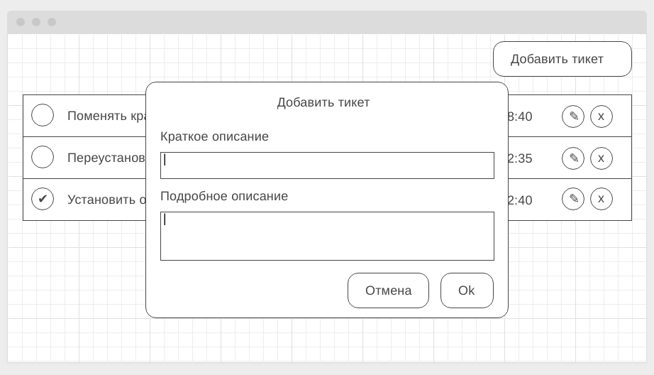

### HelpDesk: Frontend

//

// 
#### Легенда

#### Описание

Общий вид списка тикетов — они должны загружаться с сервера в формате JSON:

Модальное окно добавления нового тикета — вызывается по кнопке «Добавить тикет» в правом верхнем углу:

Модальное окно редактирования существующего тикета — вызывается по кнопке с иконкой карандашика ✎:

Модальное окно подтверждения удаления — вызывается по кнопке с иконкой x:

Для просмотра деталей тикета нужно нажать на самом тикете, но не на контролах — сделано, редактировать или удалить:

Ваше приложение должно реализовывать следующий функционал:
* Отображение всех тикетов
* Создание нового тикета
* Удаление тикета
* Изменение тикета
* Получение подробного описание тикета
* Отметка о выполнении каждого тикета

Весь этот функционал должен быть связан с сервером через методы. Например, для удаления нужно отправить запрос с соответствующим методом, получить подтверждение и подтянуть обновлённый список тасков. 
В качестве бонуса можете отображать какую-нибудь иконку загрузки (см. https://loading.io) на время подгрузки.

Автотесты к этой задаче не требуются. Все данные и изменения должны браться или сохраняться на сервере, который вы написали в предыдущей задаче.

P. S. Подгрузка подробного описания специально организована в виде отдельного запроса. На малых объёмах информации нет смысла делать её отдельно.
